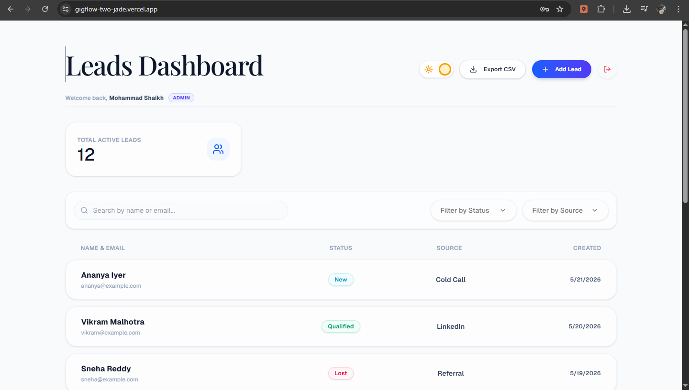

# Smart Leads Dashboard 🚀

A full-stack, enterprise-grade Lead Management CRM built with the MERN stack and strict TypeScript. Designed with clean architecture, robust state management, and a highly polished UI.



## ✨ Key Features & Highlights

- **Role-Based Access Control (RBAC):** Admin and Sales user roles. System securely hides admin-only features (like CSV Export) from Sales users.
- **Advanced Filtering & Pagination:** Server-side pagination (10 items/page) combined with debounced multi-parameter search (Name, Email, Status, Source).
- **Activity Timeline (Standout Feature):** A chronological, real-time audit trail for every lead. Tracks who created the lead and logs every status change automatically.
- **Responsive Glassmorphism UI:** Built with Tailwind CSS v4 and Shadcn components, fully optimized for both desktop and mobile viewing.
- **Dark Mode Support:** Seamless theme toggling with user preference tracking.
- **Containerized Ecosystem:** Fully Dockerized architecture (MongoDB, Node API, Vite/Nginx Frontend) for one-command deployment.

## 🛠️ Tech Stack

- **Frontend:** React 18, TypeScript, Vite, Tailwind CSS v4, React Query, Zustand (State Management), React Router.
- **Backend:** Node.js, Express, TypeScript, Mongoose, JSON Web Tokens (JWT), bcryptjs.
- **Infrastructure:** Docker, Docker Compose, Nginx.

## 🔐 Test Credentials

Use these credentials to test the Role-Based Access features:

- **Admin User:** `admin@crm.com` | Password: `password123` *(Has access to CSV Export)*
- **Sales User:** `rahul@crm.com` | Password: `password123` *(Standard access)*

## 🚀 Setup Instructions

### Option A: One-Click Docker Setup (Recommended)

Make sure Docker Desktop is running on your machine.

1. Clone the repository.
2. Run the following command in the root directory to build and start the containers:
   ```bash
   docker-compose up --build
   ```
3. **Crucial Step:** Once the containers are running, open a new terminal window and run the seed script to populate the database with the test credentials and mock leads:
   ```bash
   docker exec -it smart_leads_backend npm run seed
   ```
4. Open `http://localhost:3000` in your browser and log in with the test credentials above.

### Option B: Manual Local Setup

**1. Database & Backend:**
```bash
cd backend
npm install
npm run seed  # Automatically creates test users and mock leads
npm run dev
```

**2. Frontend:**
```bash
cd frontend
npm install
npm run dev
```

## 📂 Architecture & Folder Structure

```text
├── backend/
│   ├── src/
│   │   ├── controllers/   # Route logic and response formatting
│   │   ├── middleware/    # JWT Auth and Role checks
│   │   ├── models/        # Mongoose Schemas (User, Lead, Activity)
│   │   ├── routes/        # Express route definitions
│   │   └── services/      # Reusable business logic (e.g., Activity Logger)
│   └── Dockerfile         # Node Alpine production build
├── frontend/
│   ├── src/
│   │   ├── api/           # Axios interceptors and global config
│   │   ├── components/    # Reusable UI (Filters, Tables, Modals)
│   │   ├── hooks/         # Custom React Query & Debounce hooks
│   │   ├── pages/         # Page-level components
│   │   └── store/         # Zustand global state (Auth)
│   ├── nginx.conf         # Production routing configuration
│   └── Dockerfile         # Multi-stage Vite + Nginx build
└── docker-compose.yml     # Service orchestration
```

## 📖 API Documentation

All endpoints are prefixed with `/api` and require a Bearer token in the `Authorization` header.

### Authentication

- `POST /auth/register` - Register a new user.
- `POST /auth/login` - Authenticate and receive a JWT.

### Leads (CRUD & Filtering)

- `GET /leads` - Fetch paginated leads.  
  **Params:** `page`, `limit`, `search`, `status`, `source`, `sort`
- `GET /leads/:id` - Fetch a single lead by ID.
- `POST /leads` - Create a new lead.
- `PUT /leads/:id` - Update an existing lead.
- `DELETE /leads/:id` - Delete a lead.
- `GET /leads/export/csv` - Export filtered leads (Admin only).

### Lead Activities

- `GET /leads/:id/activity` - Fetch the chronological audit trail for a specific lead.